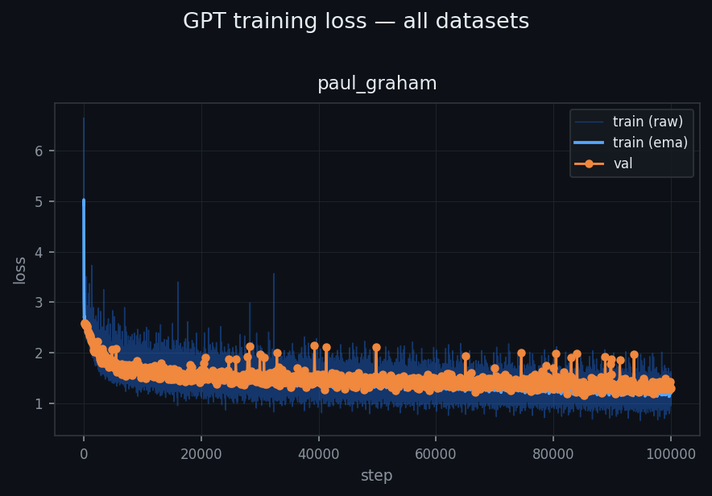
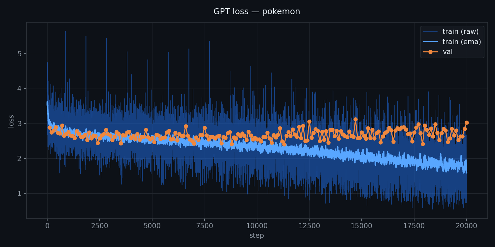

# microgpt

A minimal, educational character-level GPT trained on multiple datasets, from Pokémon names to Paul Graham essays.

Built on top of [@karpathy](https://github.com/karpathy)'s atomic pure, dependency-free Python-based GPT, ported to PyTorch with GPU support for speed and a multi-dataset training runner for variety.


## examples

### 1. Dataset: Paul Graham essays
 
```python
python run_microgpt.py \
    --only paul_graham \
    --n-embd 64 \
    --n-layer 4 \
    --n-head 4 \
    --steps 100000
```

#### Output:

```
  seed '':
It's hardered to advantage of the companies software. I could had a particularly of startups will in a language to work them was people is another in a few a tried to be and in as people such it was the story one to the consist of clear of the country our and web-sackating that were the first ideas to angel why conceral the of say success,thisy are about it has and so one startup is that there's a startup the time the same always they were all the people who wanted for the startup that they were some ads, t

  seed 'The ':
The money including is through in the reason at the really the short is one so probably is that they can't have making art. There's always in the people whose will in in effect them, and business happened it to that it's hard to get our startups to make out in a recessions. There is a millions and and something to take is an startup, founders of part that it important, they enlike to selling bad it is also at the beauted to growth of exped to raise and be on the way the schoolate of composed between every indiv

  seed 'I ':
I wish wish that you don't have to be at the term help we trev. When I think they have to be path control the best deal to say their way to have to do to for the things and the time, the problem of sities intervig the our cases with but town in mostly, though is there is a replace to angel of contination of the and that's angels. It'strinute to be situation a lot of suggests false the the core will was not secidate with interesting to world. In the country as the acquisities and and money startup century have
```




### 2. Dataset: Pokémon names

```python
python run_microgpt.py --only pokemon --steps 20000
```

#### output:

```python
  sample  1: groudan
  sample  2: minior-yello
  sample  3: sandol
  sample  4: saluma
  sample  5: magilly
  sample  6: clobe
  sample  7: groteen
  sample  8: sederis
  sample  9: gardragot-a
  sample 10: charizard
  sample 11: pikachu-seta
  sample 12: metagunce
  sample 13: piroade
  sample 14: slowble
  sample 15: pikachu-p-ta
  sample 16: sandshrew
  sample 17: salande
  sample 18: storunke
  sample 19: sediply
  sample 20: gagon
```



---

## files

```
microgpt/
├── gpt.py               # pure Python, dependency-free GPT (original karpathy style)
├── run_microgpt.py      # multi-dataset runner (the main script)
├── datasets/            # auto-downloaded, cached — never re-downloaded
└── outputs/
    ├── <dataset>/
    │   ├── loss.png     # per-dataset loss curve
    │   ├── ckpt.pt      # resumable checkpoint
    │   └── samples.txt  # generated samples
    └── all_losses.png   # combined loss plot across all datasets
```

---

## quickstart

```bash
git clone https://github.com/chizkidd/microgpt
cd microgpt
pip install torch matplotlib
```

**train everything:**
```bash
python run_microgpt.py
```

**train one dataset:**
```bash
python run_microgpt.py --only names
python run_microgpt.py --only paul_graham
python run_microgpt.py --only shakespeare
```

**smoke-test all datasets quickly:**
```bash
python run_microgpt.py --steps 100
```

**in a notebook:**
```python
!python run_microgpt.py --only paul_graham --steps 200
!python run_microgpt.py --only shakespeare --steps 500
!python run_microgpt.py --only pokemon names --steps 1000

# override model size on the fly
!python run_microgpt.py --only names --n-embd 64 --n-layer 4 --steps 2000

# headless / no display
!python run_microgpt.py --only shakespeare --no-plot

# see what's available
!python run_microgpt.py --list
```

---

## datasets

| dataset | docs | task | mode |
|---|---|---|---|
| `names` | 32k baby names | generate new names | discrete |
| `pokemon` | ~900 Pokémon identifiers | generate new Pokémon names | discrete |
| `cities` | 40k world city names | generate new city names | discrete |
| `english_words` | 370k words | generate new words | discrete |
| `paul_graham` | ~200 essays | generate PG-style prose | stream |
| `shakespeare` | ~1M chars | generate Shakespeare-style text | stream |

Datasets are auto-downloaded on first run and cached in `datasets/`. Re-runs are instant.

**discrete mode** — each sample is an independent short generation, stops at end-of-sequence. Good for names and words.

**stream mode** — generates a continuous text flow, treats end-of-sequence as a paragraph break and keeps going. Good for prose.

---

## cli reference

```
python run_microgpt.py [options]

dataset selection:
  --only   NAME [NAME ...]   train only these datasets
                             supports underscores or dashes: paul_graham == paul-graham
  --list                     print all available datasets and exit

model (overrides dataset defaults):
  --n-embd     N             embedding dimension
  --n-layer    N             number of transformer layers
  --n-head     N             number of attention heads
  --block-size N             context / sequence length

training:
  --steps      N             total training steps  (use 100 for a quick smoke-test)
  --lr         F             base learning rate  (default: 0.01)
  --batch-size N             documents per gradient step  (default: 1)
  --val-every  N             compute val loss every N steps  (default: 100)
  --clip-grad  F             gradient clip norm  (0 to disable, default: 1.0)
  --seed       N             random seed  (default: 42)

inference:
  --temperature F            sampling temperature  (default: dataset-specific)
  --topk        K            top-k filter  (0 = full distribution)
  --n-samples   N            number of samples to generate  (default: 20)
  --stream                   force continuous text generation for all datasets

i/o:
  --resume                   resume from checkpoint if one exists
  --no-plot                  skip all matplotlib output (useful on headless servers)
```

CLI flags override dataset defaults — the dataset registry is always the baseline, and anything passed on the command line wins on top. So you can use a dataset's tuned config as a starting point and just tweak one thing:

```bash
# use pokemon's config but bump the model size
python run_microgpt.py --only pokemon --n-embd 64 --n-layer 4

# quick test run, no plots, fixed seed
python run_microgpt.py --steps 100 --no-plot --seed 0

# see all datasets
python run_microgpt.py --list
```

---

## what's in each file

### `gpt.py` — pure Python, no dependencies
The original karpathy atomic GPT. Scalar autograd engine, character tokenizer, transformer forward pass, Adam optimizer — all from scratch in ~200 lines. Runs on CPU only, intentionally slow, maximally readable.

Improvements over the original:
1. **gradient clipping** — `max(-1, min(1, grad))` per parameter
2. **EMA loss smoothing** — printed alongside raw loss every step
3. **train/val split** — 90/10, val loss every 100 steps
4. **CLI config** — `--n_embd`, `--n_layer`, `--steps` etc. via `sys.argv`
5. **checkpointing** — save/resume via `json`
6. **top-k sampling** — `--topk k` at inference
7. **`generate(prompt)`** — seeded inference, not just BOS sampling
8. **loss plot** — ASCII sparkline + matplotlib PNG

### `run_microgpt.py` — PyTorch/GPU multi-dataset runner
The main script. Same GPT-2 style architecture as `gpt.py` but built with `torch.nn` for speed — runs on CUDA if available, falls back to CPU automatically. Wraps everything into a `train(name, url, **kwargs)` function and iterates over the dataset registry, auto-downloading and caching each dataset, then produces a per-dataset output folder and a combined `all_losses.png` at the end.

All 8 improvements from `gpt.py` are carried over, plus:
- **live loss plot** — matplotlib window updates in real time during training (one per dataset)
- **10-line logging** — prints exactly 10 progress lines per dataset (`n/10` steps), showing train loss, EMA, and val loss
- **stream vs discrete inference** — Shakespeare and PG generate continuous prose; names/words generate independent short samples
- **full `argparse` CLI** — all hyperparameters overridable from the command line, `.pt` checkpoints with optimizer state

---

## architecture

Standard GPT-2 style transformer, char-level:

```
input tokens
    → token embedding + positional embedding
    → RMSNorm
    → N × [RMSNorm → MultiHeadAttention → residual → RMSNorm → MLP → residual]
    → linear → logits over vocab
```

Differences from GPT-2: no biases, RMSNorm instead of LayerNorm, ReLU instead of GeLU. Keeps the code short and the concepts clear.

---

## output

After training, each dataset produces:

```
outputs/names/
├── loss.png      # train (raw), train (ema), val loss curves
├── ckpt.pt       # full model + optimizer state, resumable
└── samples.txt   # generated samples at inference temperature

outputs/all_losses.png   # all datasets in one figure
```

Sample output after 2000 steps on `names`:
```
  1: kailyn
  2: braven
  3: thessaly
  4: orin
  5: maelis
```

Sample output after 5000 steps on `paul_graham`:
```
  seed 'The ':
  The best way to get good at something is to do it a lot. This sounds
  obvious, but most people don't actually do it. They read about it, or
  they think about it, but they don't sit down and grind through the
  uncomfortable early phase where you're still bad...
```

---

## Credit

- Original Karpathy microGPT: [@karpathy](https://gist.github.com/karpathy/8627fe009c40f57531cb18360106ce95) 
    - Karpathy blog [writeup](https://karpathy.github.io/2026/02/12/microgpt/) on microgpt.
- PG essays dataset: [@sgoel97](https://github.com/sgoel97/essay-datasets)
- Baby names: [karpathy/makemore](https://github.com/karpathy/makemore)
- Shakespeare: [karpathy/char-rnn](https://github.com/karpathy/char-rnn)
- Pokémon names: [veekun/pokedex](https://github.com/veekun/pokedex)
- World cities: [datasets/world-cities](https://github.com/datasets/world-cities)
- English words: [dwyl/english-words](https://github.com/dwyl/english-words)
